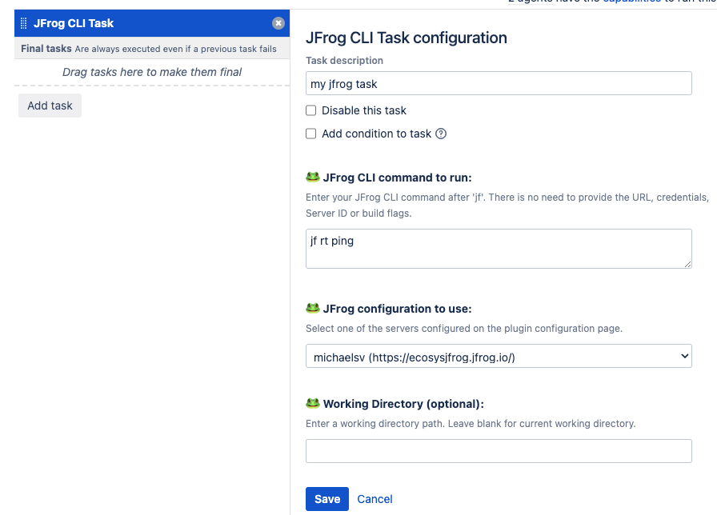

# Bamboo JFrog Plugin

## Table of Contents

- [Overview](#Overview)
- [Key Features](#Key-Features)
- [Installation](#Installation-and-Configuration)
- [Usage](#usage)
- [Contributing](#contributing)

## Overview

The **Bamboo JFrog Plugin** is designed to provide an easy integration between Bamboo and the [JFrog Platform](https://jfrog.com/solution-sheet/jfrog-platform/).
Unlike the [Bamboo Artifactory Plugin](https://plugins.atlassian.com/plugin/details/27818), the new **Bamboo JFrog Plugin** focuses on a single task that runs [JFrog CLI](https://jfrog.com/help/r/jfrog-cli/jfrog-cli) commands.
The advantage of this approach is that JFrog CLI is a powerful and versatile tool that integrates with all JFrog capabilities.
It offers extensive features and functionalities, and it is constantly improved and updated with the latest enhancements from JFrog.
This ensures that the Bamboo JFrog Plugin is always up-to-date with the newest features and improvements provided by JFrog.

This integration allows your build jobs to deploy artifacts and resolve dependencies to and
from [Artifactory](https://jfrog.com/artifactory/), and then have them linked to the build job that created them.
It also allows you to scan your artifacts and builds with [JFrog Xray](https://jfrog.com/xray/) and distribute your
software package to remote locations using [JFrog Distribution](https://jfrog.com/distribution/).

## Key Features

- **Artifact Management**: Manage build artifacts with Artifactory.
- **Dependency Resolution**: Resolve dependencies from Artifactory for reliable builds.
- **Build Traceability**: Link artifacts to their corresponding build jobs for better traceability.
- **Security Scanning**: Scan artifacts and builds with JFrog Xray for vulnerabilities.
- **Software Distribution**: Distribute software packages to remote locations using JFrog Distribution.

## Installation and Configuration

1. Download the latest release of the plugin from the [Bamboo Marketplace](https://marketplace.atlassian.com/).
2. Install the plugin on your Bamboo server.
3. Inside *Bamboo Administration* under *Manage Apps* select - *JFrog Configuration*.

   
4. Click on *New JFrog Platform Configuration*.

   
5. Configure your credentials details and run a *Test Connection* and then Save.

   

## Usage

Once installed and configured, use the plugin's task in your Bamboo build plans.
Enter the Tasks section and add the *JFrog CLI task*.

Then enter your JFrog CLI task and select the Server ID.

## Contributing

We welcome contributions from the community. Follow the guidelines in the [contribution guide](link-to-contribution-guide) to contribute to the Bamboo JFrog Plugin.
